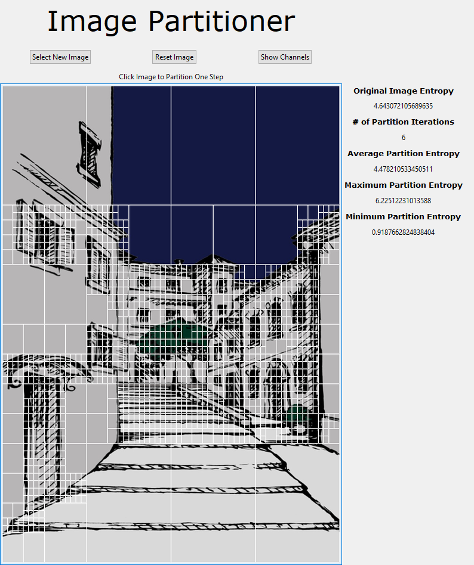

<h1 align="center"> Adaptive Image Partitioner </h1>
Partitions an image into varying sizes using entropy as a measured threshold.

<h2 align="center"> Usage </h2>
After downloading the necessary files and libraries running (`maingui.py`) will prompt you to open a local image. In order to partition the image one iteration further, click on the image's thumbnail.

<h2 align="center"> Future Updates </h2>

- [ ] Allow User Designated Threshold
- [ ] Color Channel Partitioning
- [ ] Option to Save Images
- [ ] Improve Interface

(<a href="#top">back to top</a>)

